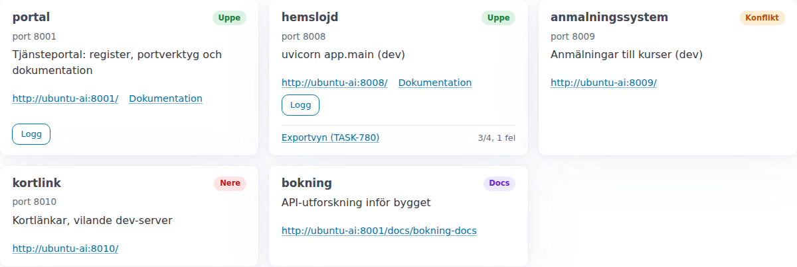
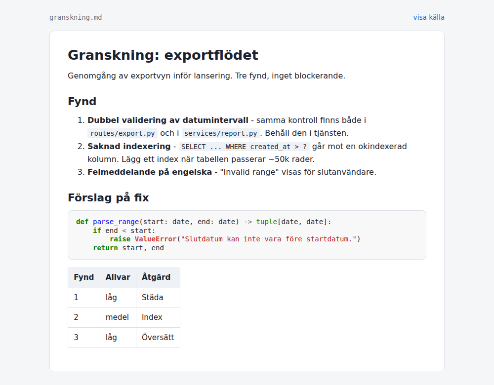
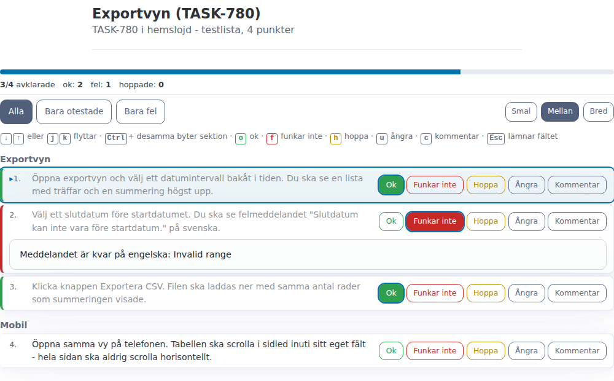
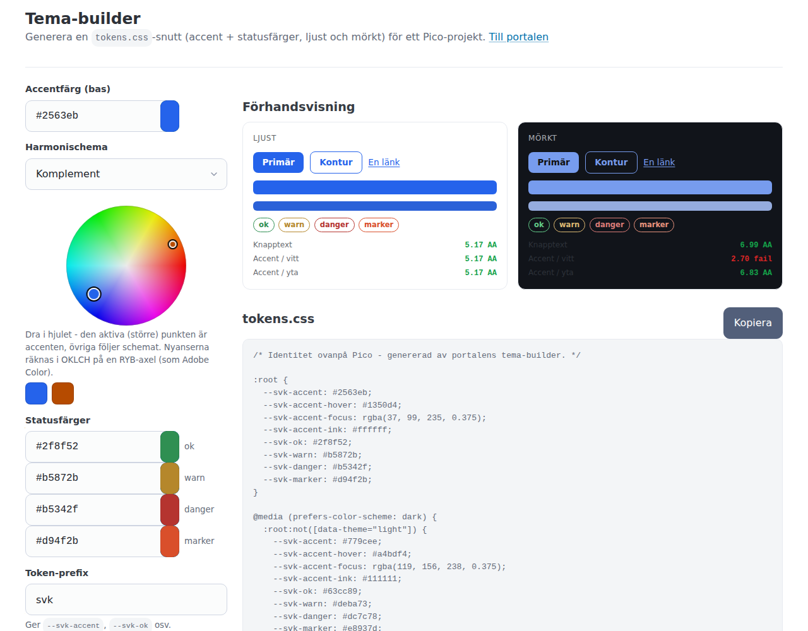

# Portal

Tjänsteportal för den delade dev-VM:en ubuntu-ai. Flera Claude Code-instanser
bygger och kör dev-servrar parallellt på samma maskin - portalen är
sanningskällan för vilka portar och tjänster som körs.

Portalen:

- visar en webbsida med kort för varje registrerad tjänst (namn, projekt,
  port, beskrivning, länk, live-status) plus en dokumentationsvy per tjänst
  (markdown renderad till HTML, eller en fristående HTML-fil serverad rakt av)
- kan registrera rena dokumentationsposter utan port - t.ex. projektdocs
  som skrivits innan någon tjänst körs - som senare uppgraderas med
  port/PID när tjänsten startas
- auto-genererar den gamla manuella liggaren
  `~/.claude/running-services.md` från databasen efter varje ändring
  (bakåtkompatibilitet: gamla instruktioner läser den filen)
- delar ut garanterat lediga portar (kollar registret, live-lyssnande portar
  via `ss -tlnp` och aktiva reservationer)
- listar alla lyssnande portar, inklusive oregistrerade
- strömmar en tjänsts logg live i webbläsaren (loggfil eller journalen för
  en systemd-unit)
- installerar långlivade projekt som systemd user-tjänster och kan starta
  och stoppa dem från kortvyn
- visar antal öppna todos per projekt (read-only från backlog-verktyget) med
  länk vidare till backlog web
- delar filer på egen URL utan att låsa en port per fil, med automatisk
  städning efter TTL - markdown renderas som läsvy
- hostar testlistor som betas av i ett UI i stället för punkt för punkt i
  chatten, och skriver sammanfattningen tillbaka till backlog-tasken
- genererar teman (accent- och statusfärger som `tokens.css`) i en
  färghjulsbyggare och sparar dem namngivet för hämtning via API

Portalen kör själv på port 8890: http://ubuntu-ai:8890



Kortvyn: ett kort per tjänst med live-status (uppe, konflikt, nere, docs),
länk, dokumentation, loggknapp och testlistans framsteg. Skärmdumparna i
den här readmen är tagna mot en demoinstans med påhittade tjänster.

## Installation

Kräver Python 3.12 och uv.

```bash
cd ~/workspace/portal
./install.sh
```

Skriptet kör `uv sync`, installerar systemd user unit-filen
(`deploy/portal.service`), startar tjänsten och länkar CLI:t till
`~/.local/bin/svc`. För start vid boot utan aktiv session krävs dessutom:

```bash
sudo loginctl enable-linger rasmus
```

Manuell start utan systemd:

```bash
cd ~/workspace/portal
uv sync
.venv/bin/uvicorn app.main:app --host 0.0.0.0 --port 8890
```

## CLI: svc

CLI:t använder bara stdlib och fungerar utan venv. Bas-URL styrs av
miljövariabeln `PORTAL_URL` (default `http://127.0.0.1:8890`).

```bash
# Lista tjänster med live-status
svc list

# Hämta och reservera en ledig port (skriver bara portnumret - skriptvänligt)
PORT=$(svc port --note "mitt-projekt dev")
PORT=$(svc port --range 8100-8199)

# Registrera en tjänst när den startats
svc register mitt-projekt --port 8123 --project mitt-projekt \
    --pid 12345 --desc "uvicorn app.main (dev)" --by "claude, mitt-projekt" \
    --docs-file /home/rasmus/workspace/mitt-projekt/README.md \
    --log-file /home/rasmus/workspace/mitt-projekt/dev.log

# Uppdatera fält
svc update mitt-projekt --pid 23456 --desc "ny beskrivning"

# Visa detaljer / avregistrera
svc show mitt-projekt
svc unregister mitt-projekt

# Alla lyssnande portar, inklusive oregistrerade
svc ports
```

Gemensamma fält på `register` och `update`: `--pid`, `--desc`, `--docs-file`,
`--docs-md`, `--log-file`, `--kind` (`ephemeral`, `systemd`, `docker`),
`--unit`, `--backlog-project` (när projektet heter något annat i backlog) och
`--autostart/--no-autostart`.

Efemära poster (default-typen) städas automatiskt bort när varken porten
lyssnar eller PID:en lever - en dev-server som dött lämnar ingen skräprad.

### Dokumentationsposter (registrering utan port)

Ett projekts dokumentation kan registreras på portalen innan någon tjänst
körs. Utelämna `--port` - då krävs i stället dokumentation via `--docs-file`
eller `--docs-md`:

```bash
# Registrera en docs-post (visas med status "docs" i list och kortvyn)
svc register mitt-projekt-docs --project mitt-projekt \
    --docs-file /home/rasmus/workspace/mitt-projekt/api-utforskning.html \
    --desc "API-utforskning inför bygget"

# Pekar docs-filen på .html/.htm serveras den rakt av som fristående
# HTML-sida på /docs/{namn}; .md renderas som markdown i docs-vyn.

# Uppgradera posten med port och PID när tjänsten väl startats
svc update mitt-projekt-docs --port 8123 --pid 12345
```

Portlösa poster får status `docs`, länkar till sin dokumentationssida i
stället för en port-URL och skrivs med `-` i liggarens portkolumn.

### Permanenta tjänster (systemd)

`svc install` gör ett projekt långlivat: kommandot skriver en systemd
user-unit lokalt på VM:en och registrerar bara unit-namnet i portalen
(startkommandot lämnar aldrig maskinen). Sådana poster får typen `systemd`
och kan startas och stoppas från kortvyn - portalen styr bara units den
själv installerat.

```bash
svc install mitt-projekt \
    --cmd "/home/rasmus/workspace/mitt-projekt/.venv/bin/uvicorn app.main:app --port 8123" \
    --cwd /home/rasmus/workspace/mitt-projekt \
    --port 8123 --autostart
```

### Loggströmning

Har en post en känd loggkälla får dess kort en **Logg**-knapp som strömmar
loggen live i webbläsaren. Källan är antingen `--log-file` (valfri tjänst)
eller journalen för en systemd-unit registrerad med `--kind systemd
--unit NAMN.service`.

```bash
# Efemär dev-server: peka ut loggfilen
svc update mitt-projekt --log-file /home/rasmus/workspace/mitt-projekt/dev.log

# Systemd-tjänst: journalen används automatiskt
svc register min-tjanst --port 8123 --project x --kind systemd \
    --unit min-tjanst.service
```

### Fildelning

`svc share` laddar upp en fil till portalen och skriver ut en länk under
`/share/{uid}/{filnamn}` - ingen extra port behöver låsas för att visa en
rapport eller en bild. Delningen städas automatiskt när TTL löper ut
(default 120 minuter, `--ttl 0` = tills `unshare`). Markdown-filer renderas
som en stylad läsvy med syntaxfärgade kodblock; `?raw=1` ger källan.



```bash
svc share rapport.md --desc "Granskning av X" --ttl 1440
svc shares
svc unshare a1b2c3d4e5f6
```

### Testlistor

`svc test-session` lägger testpunkterna i portalen i stället för i chatten:
en numrerad markdown-lista blir en sida där varje punkt markeras ok, fel,
hoppad eller lämnas otestad, med plats för en anteckning. `close` skriver
sammanfattningen som kommentar på backlog-tasken. Alla listor med framsteg
finns på http://ubuntu-ai:8890/test.



```bash
svc test-session create mitt-projekt-780 --title "Testa exportvyn" \
    --items-file testpunkter.md --task TASK-780 --project mitt-projekt
svc test-session list
svc test-session show mitt-projekt-780 --only fel
svc test-session close mitt-projekt-780
```

Punkterna parsas ur markdown: varje testfall börjar med `N. ` i början av en
rad, och grupperas med `## rubrik`.

### Tema-buildern

http://ubuntu-ai:8890/tema genererar en `tokens.css`-snutt till Pico-baserade
projekt: välj accent- och statusfärger på ett färghjul, utforska
harmonischeman, se live-preview i ljust och mörkt läge med WCAG-avläsning,
och exportera CSS:en. Mörkvarianter härleds automatiskt ur ljusfärgerna.


Teman kan sparas namngivet och hämtas rått via
`GET /api/themes/{namn}/tokens.css`, så ett tema kan designas i webbläsaren
och hämtas in i ett projekt utan att kopieras för hand.

## API-översikt

Interaktiv API-dokumentation: http://ubuntu-ai:8890/api/docs

| Metod | Sökväg | Beskrivning |
|-------|--------|-------------|
| GET | /api/health | Hälsokoll |
| GET | /api/services | Alla tjänster med live-status |
| GET | /api/services/{name} | En tjänst |
| POST | /api/services | Registrera tjänst |
| PATCH | /api/services/{name} | Uppdatera fält |
| DELETE | /api/services/{name} | Avregistrera |
| GET | /api/services/{name}/logs | Loggström (SSE) |
| POST | /api/services/{name}/start | Starta portalinstallerad systemd-tjänst |
| POST | /api/services/{name}/stop | Stoppa portalinstallerad systemd-tjänst |
| GET | /api/ports | Lyssnande portar + registrerade tjänster |
| POST | /api/ports/reserve | Reservera ledig port, svarar {"port": N} |
| GET | /api/todos | Öppna todos per backlog-projekt |
| GET | /api/shares | Aktiva delningar |
| POST | /api/shares | Skapa delning (fil base64-kodad i JSON) |
| DELETE | /api/shares/{uid} | Ta bort delning (rad + fil) |
| GET | /api/themes | Sparade teman |
| POST | /api/themes | Spara/uppdatera tema (upsert på namn) |
| GET | /api/themes/{name} | Ett tema med spec |
| GET | /api/themes/{name}/tokens.css | Temats CSS som rå text/css |
| DELETE | /api/themes/{name} | Ta bort tema |
| GET | /api/test-sessions | Alla testlistor med framsteg |
| POST | /api/test-sessions | Skapa testlista ur markdown |
| GET | /api/test/{slug} | En testlista |
| POST | /api/test/{slug}/items/{position} | Sätt status/anteckning på en punkt |
| POST | /api/test/{slug}/close | Stäng och kommentera backlog-tasken |
| DELETE | /api/test/{slug} | Ta bort testlista |

Statusvärden per tjänst:

| Status | Betydelse |
|--------|-----------|
| `up` | Porten lyssnar (PID okänd eller matchar), eller systemd-uniten är aktiv |
| `conflict` | Porten lyssnar men med annan PID än den registrerade |
| `down` | Inget lyssnar, och uniten är inte aktiv |
| `drift` | Systemd-unit och verklighet går isär (aktiv utan port, eller inaktiv med port som lyssnar) |
| `starting` / `stopping` | Uniten håller på att starta respektive stoppa |
| `docs` | Dokumentationspost utan port |
| `unknown` | Systemd-statusen kunde inte läsas |

Portreservationer gäller 15 minuter och städas därefter bort automatiskt.
När en tjänst registreras på en reserverad port förbrukas reservationen.

## Liggaren

`~/.claude/running-services.md` skrivs om av portalen efter varje
create/update/delete. Redigera den inte för hand - använd `svc` eller API:t.
Vid appstart importeras tabellrader vars port inte redan finns i databasen
(så manuellt tillagda tjänster från gamla flödet inte tappas); databasen
vinner vid konflikt.

## Konfiguration

Allt är överridbart via miljövariabler, se `.env.example` för hela listan -
bland annat databas- och liggarsökväg (`PORTAL_DB_PATH`,
`PORTAL_LEDGER_PATH`), portalens egen host och port, hostnamnet som används
i länkar (`PORTAL_SERVICE_HOST`, default `ubuntu-ai` - aldrig localhost),
TTL och maxstorlek för delningar samt sökvägen till backlog-CLI:t.

## Docker (reservspår - systemd är primär driftväg)

Containern behöver host-nätverk och host-PID-namespace för att `ss -tlnp`
ska se värdens portar och processer, samt volymer för databasen och liggaren:

```bash
docker build -t portal .
docker run -d --name portal \
    --network host --pid host \
    -v ~/workspace/portal/data:/app/data \
    -v ~/.claude/running-services.md:/root/.claude/running-services.md \
    -e PORTAL_LEDGER_PATH=/root/.claude/running-services.md \
    portal
```
